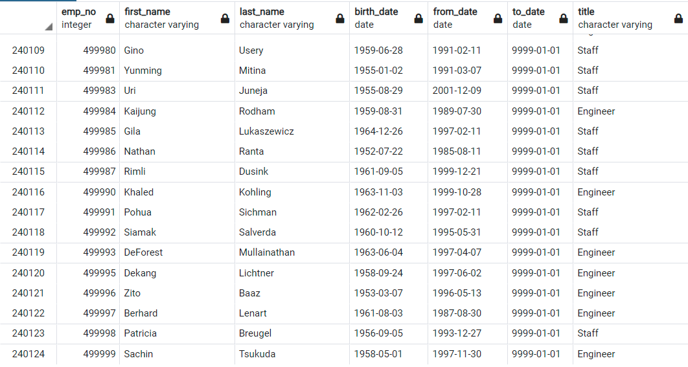
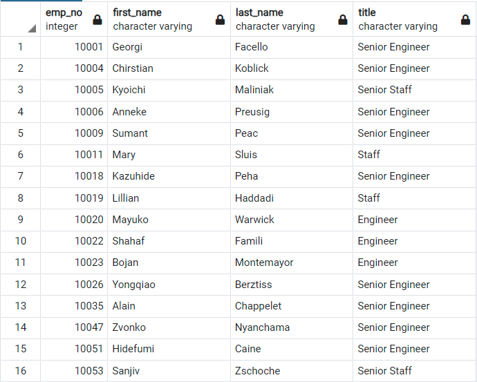
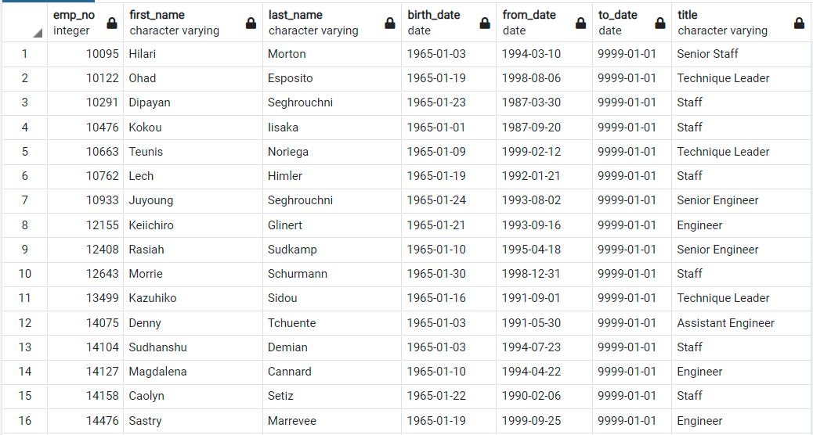
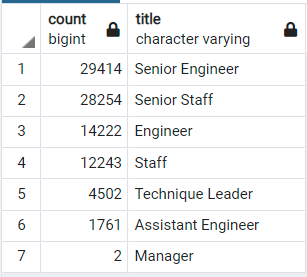
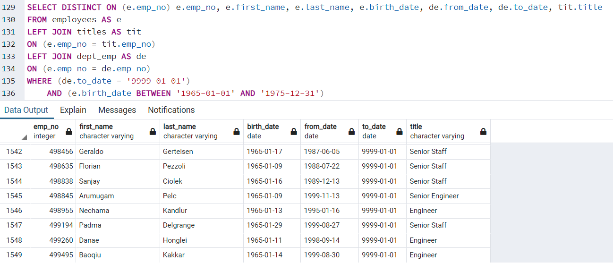

# Pewlett Hackard Analysis

## Overview of the analysis
Our task for this week was to help out at Pewlett Hackard in figuring out how many employees will be retiring soon, how many will be able to mentor before they leave, and how that will affect the newer employees who *do* need to be trained/mentored. The __*Silver Tsunami*__ is coming.

## Results
* There are currently 240,124 current employees working at Pewlett Hackard as of the data given. 

* Out of the 240,124 current employees, about 90,398 are set to retire soon. That is an upcoming near __*38%*__ of the current workforce will be leaving within the coming few years and the struggle to replace them will be strenuous on the mentors and be a constant battle in maintaing the number of employees consistent.

* The __*Silver Tsunami*__ will consist of those born around 1955 and the mentors will be around 1965. This gives a cushion of 10 years of mentorship for the eligible mentors if *all* of them are instated as such.

* If each were to mentor all 10 years until retirement, they would each have to mentor 5-6 new employees a year, but this will __ONLY__ replace those who left in the __*Silver Tsunami*__ originating from 1955. To replace those born in the time frame between 1955-1965 would have to be closer to double in order to keep the *current employee* serial near constant. Fighting againt the __*Silver Tsunami of 1955*__ will take a lot of time and effort from even younger __*Tsunamis*__.

## Summary
   * How many roles will need to be filled as the "silver tsunami" begins to make an impact? 
         
        * 90,398 employees will retire within the __*Silver Tsunami of 1955*__. A 1 to 1 replacement would be a minimum, but as a company wants to grow, it must also increase the number of employees, so a larger ratio must be the true goal.

   * Are there enough qualified, retirement-ready employees in the departments to mentor the next generation of Pewlett Hackard employees?
         
        * Depending on how long it takes to mentor/train a single new employee, with a timeline of 10 a year constituting a little over a month of personal training by a mentor, it also depends on how much training is *REQUIRED*. *IF* one month is enough, then it is within reason to believe that PH can keep its employee count consistent. However, as I looked into the data given at the upcoming __*Silver Tsunamis of 1965 and 1975*__ the number of young employees eligible for mentoring is nonexistent. PH *MUST* focus on also hiring younger talent while there's still mentorship available, or else the company will shrink with time.

